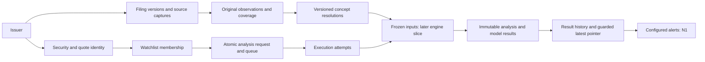

# S2 — Storage and point-in-time proposal

Status: proposed for review, 2026-09-12. S1's 40 concepts and conservative source
rules were accepted when the user directed work to S2. This document proposes
schema shape and execution semantics; no migrations or production queries have
been written or applied.

## Decisions requested

| ID | Recommendation | Reason |
| --- | --- | --- |
| S2-01 / D006 | Implement the financial evidence foundation and durable watchlist/request records first. Specify later P0/N1 storage contracts here, but create those tables with their implementing milestones. Do not create unused P1/P2 tables. | The build guide's “all tables” conflicts with P0 scope and unreviewed future contracts. |
| S2-02 | Store issuer identity separately from traded securities; store raw observations separately from normalized resolutions. | One issuer can have ordinary shares/ADS or multiple classes. Competing tags and original contexts must survive normalization. |
| S2-03 / D012 | Use an inclusive SEC filing-calendar-date cutoff, plus an independently pinned retrieval vintage. Call it an **as-filed-by-date reconstruction**, not exact intraday public knowledge. | A current SEC download can contain old filings and later source corrections. |
| S2-04 | Choose the eligible reporting edition/coverage before resolving concepts. Preserve a missing/conflicting newest resolution rather than falling back to an older valid number. | Prevents TSM's missing FY2025 financials becoming FY2024 and prevents stale values reappearing after a correction. |
| S2-05 | Preserve completed analysis snapshots and model runs; keep job progress and “latest” pointers separately mutable. | A watchlist addition/rerun refreshes analysis without overwriting history. |

The reviewer can accept these recommendations together or amend individual IDs.
The [test plan](test-plan.md) defines observable outcomes before implementation.
The new [watchlist workflow](../../features/W1-watchlist-analysis.md),
[manual](../../features/U1-user-manual.md) and
[news agent](../../features/N1-news-and-macro-agent.md) are already authorized
product requirements; this gate concerns their underlying persistence choices.

## Implementation slices

**S2a: evidence foundation.** Identity, source captures, filings/versions, periods,
units, mapping revisions, normalized resolutions, quality/event records and the
KHC point-in-time regression. Implement the accepted concept enum with generated
TS members at this slice, not a manually maintained duplicate vocabulary.

**S2b: durable requests.** Watchlists, active membership, immutable analysis
requests and execution/stage records. Prove atomic add/enqueue and retry identity
with a fake worker; real upstream adapters and financial stages remain later work.

**Later reviewed slices.** S4 price/macro observations; S5–S7 assumptions, frozen
analysis inputs and model outputs; N1 events/briefs/delivery; S8/W1 orchestration
and UI. Their required fields/invariants below prevent incompatible designs now,
but their full contracts are reviewed before migrations at those milestones.
This is an explicit proposed resolution of D006, not a claim all of S2 is coded.

## Relationship overview

Later slices are labelled; the diagram describes the intended flow, not running
workers or an implemented product.

## Global types and integrity

- Internal IDs: UUID generated before a transaction; CIK remains nullable text
  with ten-digit validation and a unique non-null value. Ticker is never a key.
- Reported amounts: finite PostgreSQL `NUMERIC` without a fixed scale, Python
  `Decimal`, original numeric token/lexical text retained. Fixed-scale coercion
  could silently round share/EPS values. Reject NaN/infinities; do not map them to
  financial NULL. Exact decimal interchange is required; S6 will freeze its encoding.
- `concept_std` is checked-in Python enum vocabulary with generated TS members.
  Database columns use TEXT with a named CHECK generated from the same 40-member
  list; no independent lookup-table vocabulary or manually duplicated list.
- Source dates use `DATE`; actual timestamps use `TIMESTAMPTZ`. Preserve source
  timezone/precision, especially when acceptance/publication time is unknown.
  No midnight timestamp is manufactured from a date-only source.
- Financial and evidence rows are append-only. Published batches, snapshots and
  model runs reject UPDATE/DELETE through runtime DB privileges and database
  guards. Mutable membership, queue leases, pointers, delivery status and flag
  acknowledgements are separate. Migration ownership is not granted to the worker.
- No cascade deletion of historical financial evidence. Explicit retention/export
  work is separate. User removal from a watchlist ends a membership, not the issuer.
- Every foreign-key relationship is enforced; cross-issuer/capture/period consistency
  uses composite keys or deferred constraint triggers where a simple FK is insufficient.
  Application assertions alone are not the final integrity mechanism.
- Every nullable identity component has deliberate NULL semantics. Use non-null
  period/scope IDs and `UNIQUE NULLS NOT DISTINCT` where needed, not sentinel
  dates, empty ticker strings or fake security IDs.

PostgreSQL documents [exact numeric storage and scale coercion](https://www.postgresql.org/docs/16/datatype-numeric.html),
[NULL-aware uniqueness and foreign keys](https://www.postgresql.org/docs/16/ddl-constraints.html),
and [date/time behavior](https://www.postgresql.org/docs/16/datatype-datetime.html).
These choices are proposed for PostgreSQL 16, matching S0.

## S2a data dictionary

Unless stated otherwise, IDs and foreign keys are non-null UUIDs; `?` explicitly
marks nullable data. Timestamps ending `_at` are timezone-aware. Text identifiers
and numeric observations retain the source's meaning, not a display abbreviation.
Tables below are the complete proposed S2a scope; join records are included.

| Table | Essential columns | Keys, constraints and purpose |
| --- | --- | --- |
| `issuers` | id, cik?, legal_name, first_seen_at | Unique non-null CIK. Facts attach to a reporting entity, not every ticker that references it. |
| `securities` | id, issuer_id, instrument_kind, share_class_label?, underlying_security_id?, active | Ordinary/common class and ADS are distinct instruments. No self-underlying or cross-issuer relationship; unknown class is explicit and blocks class-sensitive calculations. |
| `security_identifiers` | id, security_id, symbol, exchange_code, quote_currency, valid_from, valid_to?, source_capture_id | Half-open validity intervals; no overlapping assignment of the same exchange/symbol to different securities. Preserve ticker changes/reuse; no naked symbol auto-resolution. |
| `security_relationships` | id, security_id, underlying_security_id, valid_from, valid_to?, underlying_units, instrument_units, source_capture_id | Positive exact ratio, non-overlapping dates per relationship, same issuer; preserve dated ADS ratio without rewriting history. Stock splits are separate source events, not edits to old share observations. |
| `sources` | id, source_key, name, base_url, terms_review_reference, content_scope | Unique source_key; contact/API secrets remain local configuration. Captures retain their terms-review reference so later source metadata edits cannot relabel history. |
| `source_captures` | id, source_id, source_object_key, request_url, request_params_hash, requested_at, completed_at?, fetched_at?, http_status?, body_sha256?, blob_key?, byte_count?, content_type?, terms_review_reference | Successful body-bearing captures require a verified blob/hash/count. Failed attempts remain distinguishable; archive before parse. Only actual network attempts create capture rows. Cache reuse is recorded on the stage attempt referencing the old capture; it never creates a new fetch timestamp. Same bytes fetched again are a separate retrieval event. The stable source_object_key groups requests for the same logical source resource. |
| `filings` | id, issuer_id, accession | Unique issuer/accession, no metadata overwrite. |
| `filing_versions` | id, filing_id, metadata_capture_id, filed_date, acceptance_at?, acceptance_time_basis?, form, report_period_end?, source_url, metadata_hash | Same accession can have separately captured metadata/source corrections. Original raw documents and Company Facts are linked evidence, not assumed byte-identical sources. Unique filing/capture/metadata_hash; acceptance order requires verified timezone. |
| `periods` | id, period_kind, start_date?, end_date | `instant` requires NULL start; `duration` requires start ≤ end. Unique NULLS NOT DISTINCT(kind,start,end). Fiscal focus `fy/fp` stays source metadata rather than identity. Annual/quarter/YTD presentation belongs to coverage below. |
| `units` | id, unit_key, numerator_measures, denominator_measures | Unique canonical measure identity, plus source spelling on each observation. USD, TWD, USD/shares, TWD/shares and shares are distinct; a unit never implies an ADS ratio. |
| `semantic_scopes` | id, issuer_id, instrument_id?, scope_kind, descriptor_schema_version, descriptor_json, content_sha256 | Immutable full economic-scope descriptor; unique issuer/schema-version/content hash with full-content collision comparison. Unknown and known-empty context remain different. |
| `mapping_revisions` | id, revision_key, content_sha256, code_revision, approved_at, approved_by, reviewed_scope | Unique immutable revision/content hash for checked-in rules and issuer/era overrides. Only reviewed revisions may publish resolutions. No mutable runtime coalesce list. |
| `normalization_batches` | id, issuer_id, mapping_revision_id, normalizer_revision, source_authority_policy_revision, created_at, published_at?, state, input_manifest_hash? | States building/published/failed. Publication seals all child inputs/coverage/resolutions in one transaction; published data is immutable. Failed/incomplete batches are never query candidates. |
| `normalization_inputs` | batch_id, source_capture_id, role | Composite primary key; explicit capture manifest including financial payload, filing metadata and any original document. All successful referenced bodies must exist before publication. |
| `statement_coverage` | id, batch_id, filing_version_id, period_id, statement_family, period_label?, reporting_basis, scope_id, currency_unit_id?, authority_class, assurance, coverage_state, evidence_locator | Unique NULLS NOT DISTINCT(batch,filing-version,period,family,basis,scope,currency). Unknown currency is allowed only for unresolved coverage and blocks value selection; it cannot be filtered away to revive an older edition. Authority and assurance are evidence-backed, not guessed solely from form type. Coverage records whether a filing actually covers a requested statement period, whether the selected source lacks its facts, or scope is unresolved. Annual/YTD/quarter labels are evidence-based. No invented current period merely from today's year. |
| `source_observations` | id, source_capture_id, filing_version_id, source_locator, namespace, tag, period_id, unit_id, numeric_value?, value_state, original_numeric_text?, context_id?, raw_dimensions?, context_knowledge, parser_revision, transform_metadata, raw_metadata | Unique capture/locator; full raw row/context retains fy/fp/form/frame, sign/scale/precision and source labels, including NULL labels. States numeric/source_nil/unparseable. `numeric` requires finite value; other states require NULL. Do not create an observation for an absent tag. |
| `fact_resolutions` | id, coverage_id, concept_std, semantic_scope_id, instrument_id?, unit_id, status, selected_observation_id?, reason? | Unique NULLS NOT DISTINCT(coverage,concept,semantic_scope,instrument,unit). Status observed/source_nil/missing/ambiguous/unsupported_scope/stale_source. Observed requires a numeric source observation; source_nil requires its explicit nil observation; other states have no selected value. Missingness requires a reason and a linked flag. |
| `resolution_candidates` | resolution_id, observation_id, rule_reference, disposition, explanation | Composite primary key. Retain considered/rejected alternatives and why; prevents a “winner” from erasing disagreement or incompatible scope. |
| `data_quality_flags` | id, batch_id?, resolution_id?, issuer_id, security_id?, period_id?, rule_key, severity, message, evidence_references, raised_at | Evidence-bearing immutable finding. At least one affected scope is explicit. Acknowledgement is a separate record and does not make a flagged value usable. |
| `quality_flag_acknowledgements` | id, flag_id, acknowledged_by, acknowledged_at, note | Audit action; cannot change flag severity or source data. |
| `filing_events` | id, issuer_id, event_kind, announced_date, announced_at?, effective_date?, source_filing_version_id, evidence_locator, description | Non-reliance, withdrawal, formal correction, accounting recast and source correction are distinct. A later different number alone cannot establish the event type. |
| `filing_event_scopes` | event_id, filing_id?, period_id?, concept_std? | Explicit affected filings/periods/concepts; at least filing or period required, with NULL-aware uniqueness. Non-reliance/withdrawal requires explicit affected filing IDs; a period-only scope cannot automatically taint later replacement editions. No unrelated-period blanket invalidation. |
| `fact_revision_links` | earlier_resolution_id, later_resolution_id, relation_kind, filing_event_id?, rationale, evidence_reference | Same entity/concept/period/scope/unit; no self-link or cycles. Error-restatement links require supporting event/evidence. Repeated unchanged comparatives do not automatically create restatement links. |

### Context, value and missingness rules

`semantic_scope_id` references the immutable `semantic_scopes` record. Its full
versioned descriptor and content hash are included in the batch manifest. It identifies consolidation/ownership,
continuing/discontinued operations, share instrument, expense/payment basis and
relevant dimensions; it is not an opaque undocumented label. Collision checks
compare full descriptors as well as hashes. Known empty dimensions, unknown
context and an original filing's actual dimensional context are distinct states.
Company Facts does not provide original context IDs; never invent them. A reviewed
issuer/era mapping may establish economic scope, but must record that evidence.

A normalized-value read joins a resolution to its selected observation only for
`observed`; otherwise it returns NULL plus status, reason and flags. No duplicate
stored normalized amount is needed in S2. Raw parsing of sign/scale is recorded
in the observation's transform metadata; S2 mappings select directly reported
values. Derived totals/TTM/ratios are separate versioned outputs, never silently
inserted as reported facts. A reported zero is an observed numeric value.

Publication validation enforces capture → filing → issuer, observation → period/
unit/scope and resolution → matching coverage. The same observation cannot be
selected under an incompatible currency, instrument or ownership scope. Every
missing/ambiguous/unparseable resolution emits a quality flag transactionally.
No rows are removed from the PIT candidate set just because their values are NULL.

## Point-in-time selection contract

The proposed read interface takes issuer/security, exact requested periods and
statement families, one history mode, optional filed-date cutoff, a required
retrieval vintage/capture manifest, explicit normalization batch IDs, normalizer
revision, mapping revision and source-authority policy revision. It returns resolutions,
selected edition IDs, evidence and flags; never a bare numeric table.

Modes:

- `as_filed_by_date`: newest eligible reporting edition on or before the inclusive
  SEC filing date. No claim of exact intraday public availability.
- `original_as_filed`: earliest eligible reporting edition for the period, also
  constrained by any supplied cutoff and captured-source vintage. This is a
  separate mode; “as reported” cannot ambiguously mean either first or latest.
  If earliest-filing completeness is unverified, label it “earliest available”
  with a history-completeness flag rather than certifying the true first report.
- `latest_reported`: newest eligible edition in the pinned source bundle. The
  complete result is labelled revised/current view, with exact period dates.

Source authority is a separate policy from chronology. The default financial
statement view uses definitive periodic statements (10-K/10-Q/20-F and their
amendments as applicable), with `authority_class` periodic_complete or an explicitly
reviewed equivalent. A form code alone does not prove completeness or audit status.
Preliminary earnings releases and unknown statement authority are excluded from
this default and remain available as separate disclosure evidence. `assurance`
records audited/unaudited/unknown; valid interim statements may be unaudited.
An audited-required query cannot silently select a newer preliminary or unaudited
number. A reviewed 8-K exhibit containing equivalent statements can be eligible
only with scope/evidence and a versioned explicit policy. Original/revised KHC
10-K values meet the test's policy; later repeated 8-K rows remain raw evidence.

One mode and capture policy applies to the entire analysis. Filings can contain
several periods; use coverage for each actual period, not `fy` or a calendar frame.
For a coherent statement family/period/scope, pick the edition before concepts.
Missing lines in that edition stay missing; do not combine them with old values.
Across statement families, check filing/accounting-basis compatibility and flag
unsupported combinations before calculating an identity or ratio.

Selection order:

1. Restrict to the explicit published normalization batch IDs and their input
   captures/mapping/normalizer/authority revisions. A timestamp-vintage preparation
   selects the latest complete successful capture at or before that time per
   source_object_key and source role, retaining all superseded versions. Failed
   newer attempts remain freshness/error evidence. Distinct bytes at an identical
   timestamp without reliable order are ambiguous; byte-identical captures may be
   co-referenced. A saved analysis pins batch and capture IDs, not a moving pointer.
   Multiple batches from identical inputs/revisions must agree in output hash;
   otherwise report nondeterministic normalization and publish neither as a default.
2. Restrict filing versions by issuer and history mode/cutoff. Use the selected
   source-role capture for same-accession metadata/observations, enforcing the
   authority policy; preserve superseded captures.
3. Find evidence-backed coverage for the exact requested period/family/scope/unit.
   A later filing covering another period cannot delete the earlier period's facts.
4. Choose the eligible edition by filed date and, where all competing timestamps
   are trustworthy, acceptance order. Conflicting same-day editions without reliable
   order return ambiguity. Accession text, insertion order and UUID are not tie breakers.
   Equivalent duplicate observations can be co-referenced with their evidence retained.
5. Return all concept resolutions for that edition, including missing/conflicting
   states. Unknown coverage is an explicit gap, not permission to search backwards.
6. Apply relevant filing events known by the analysis cutoff/vintage. Use public
   announcement timing, not an earlier private determination date,
   for this reconstruction. An affected original edition remains non-reliable even
   after a replacement is published: original mode can show it as evidence but cannot
   use it for valuation. A supported revised edition has its own eligibility; its
   existence does not rehabilitate the original. Only an explicit evidenced reinstatement
   could do that. Acknowledgement never clears the restriction.
7. Freeze the selected rows, capture IDs, scope, mode, periods, flags and transform/
   mapping versions before any calculation starts. Late fetches cannot alter inputs
   halfway through an execution.

The KHC expected pair is **10999000000 USD** at cutoff **2018-02-17** and
**10941000000 USD** at **2019-06-08**, both for 2017-01-01 → 2017-12-30 parent
income, using the archived source vintage. Asking what this application had
actually captured in 2018 must return no capture: the files were fetched in 2026.
See [the regression plan](test-plan.md) for the distinction and all adversarial cases.

## S2b watchlist and execution records

P0 uses one local workspace identity, without adding an authentication system.
Every request/membership still has that owner identity, so later users cannot be
silently conflated. Identifiers and ownership are explicit even in single-user use.

| Record | Essential fields | Invariant |
| --- | --- | --- |
| `workspaces` | id, name, display_timezone, created_at | Local workspace, not a remote user account. |
| `watchlists` | id, workspace_id, name, created_at | One default list initially; no implicit holdings/positions. |
| `watchlist_memberships` | id, watchlist_id, security_id, quote_identifier_id, added_at, removed_at?, generation | Partial unique active watchlist/security; chosen exchange/currency is preserved by its quote identifier. Old membership preserved. Re-add creates a new generation. |
| `analysis_requests` | id, workspace_id, security_id, quote_identifier_id, trigger, membership_id?, parent_request_id?, request_sequence, idempotency_key, requested_at, history_mode, filed_cutoff?, requested_periods, retrieval_policy, request_parameters_hash | Immutable request. Unique workspace/idempotency key; same key/different parameters is an error. Sequence allocated by a DB sequence, with unique workspace/security/sequence; gaps are allowed. Parent request, membership and quote identifier must match workspace/security and the intended listing validity. Distinct explicit reruns get new IDs. |
| `analysis_request_state` | request_id, current_execution_id?, attempt_epoch, terminal_outcome?, updated_at | One mutable control row per request; current execution belongs to it. Request-wide fencing prevents two retries from publishing. Result FK and one-publication constraint are added with snapshots later. |
| `analysis_executions` | id, request_id, attempt_no, state, current_stage?, available_at, lease_owner?, lease_expires_at?, fencing_token, cancellation_requested_at?, started_at?, finished_at?, error_code?, error_detail? | Unique request/attempt; only the request-state current attempt/epoch with a valid lease can advance or publish. Retrying preserves request identity. No completed model value is stored in this mutable record. |
| `analysis_stage_attempts` | id, execution_id, stage_key, attempt_no, state, started_at?, finished_at?, input_manifest?, result_reference?, error_code?, error_detail? | Unique execution/stage/attempt. Source calls, reusable captures, unsupported stages and failures remain traceable. Finished attempts cannot be rewritten. |
| `execution_events` | id, execution_id, event_sequence, event_kind, occurred_at, detail | Append-only state-transition history; mutable job state is a projection of these transitions. |

The selected quote identifier records the user's exchange/currency choice, and
must belong to the security. P0 permits one active pricing choice per security in
a watchlist; an explicit venue change creates a fresh request rather than silently
changing historical price context. Price observations will retain venue/currency
identity as well as security identity.

`assumption_set_id` is intentionally not a column in S2b: its typed FK is added
when S5–S7 creates the referenced assumption-set table. S2b rejects unknown
assumption-ID parameters rather than hiding unenforced references in JSON.

Membership creation, request, request-state and queued execution commit together.
Claim/advance/cancel/finish operations and their execution events also commit in
one transaction. Closing an attempt, advancing request-wide epoch/current attempt
and creating its retry are atomic. Later snapshot publication uses that same
request-wide control plus a unique published snapshot per logical request, not
merely per execution. A stale retry cannot publish a second snapshot.
The PostgreSQL execution table is the durable queue; Redis may wake/cache workers
but is not the sole record of pending work. This avoids a DB-versus-queue crash
window without adding a redundant outbox for the same database worker. When later
external message delivery is introduced, it gets its own durable delivery records.

Workers claim due rows transactionally with row locking; `SKIP LOCKED` is suitable
for the queue claim, not for consistent financial snapshots. No DB transaction is
held across a network call. Lease renewal/fencing and request-wide
compare-and-swap state changes prevent an expired or superseded attempt from publishing. See [PostgreSQL locking documentation](https://www.postgresql.org/docs/16/sql-select.html).

Proposed states: queued, running, waiting_for_input, retry_scheduled, completed,
completed_with_gaps, failed, cancelled. Completion-with-gaps is not a complete
valuation. Supplying/editing an assumption set creates a new request linked to
the earlier request/result; it does not silently mutate a frozen snapshot.
An active duplicate Add opens existing membership/work; explicit Refresh creates
a new request. Separate explicit Refresh requests queue with distinct identities;
only duplicate Add/transport retries with the same intent are coalesced. This avoids hidden
request-to-execution sharing in the initial schema.

## Required later contracts

These records are specified enough to constrain the shared design, but are **not
in the proposed S2a/S2b migrations**. No loosely validated production JSON blobs
are introduced as substitutes for their later typed contracts.

| Milestone / records | Required fields and invariants |
| --- | --- |
| S4 `price_daily` | security, exchange/quote identifier, market session date, currency, source capture, unadjusted OHLC/volume, adjusted values and corporate-action adjustment basis/vintage. Preserve later provider corrections rather than overwriting. Unique version key includes session date; any Timescale hypertable unique key includes its partition column. |
| S4 `macro_observations` | series identity, observation/reference date, value/unit/seasonal basis, publication time precision, source vintage/effective interval and capture. Unavailable historical vintage is not a current-series backfill. Separate series definition from observations. |
| S5–S7 `assumption_sets` / `assumptions` | immutable set/revision, parent set, confirmation, individual typed key/value/unit/kind/confidence/rationale/source rows. No fabricated defaults. Source-linked hard data references exact facts. Sensitivity ranking belongs to derived run outputs, not mutable assumption rows. |
| S5–S7 `analysis_input_snapshots` / typed input references | immutable request/execution, history policy, exact fact/price/macro/capture/mapping references, assumption set, input hash and completeness flags. Freeze before computation. Typed FKs, including composite price/macro keys, replace unchecked generic reference strings. |
| S5–S7 `analysis_snapshots` / stage results | immutable finished execution, input snapshot, outputs or unavailable reasons, generation time, engine versions, gaps. One published snapshot per logical request, also uniquely tied to its completing execution; late or cancelled executions cannot publish over valid newer pointers. |
| S7 `model_runs` / run inputs and outputs | immutable security/model version, input snapshot, parent run, assumptions, typed/versioned outputs. Rows published atomically; changing an assumption creates a child run. No blanket uniqueness on input hash: intentional recomputation must remain traceable. |
| S8 `latest_analysis` | separate latest-request and last-successful-compatible-result references, guarded by request sequence. A late old request cannot overwrite a newer successful result. Show old freshness during failure/new work. |
| N1 `macro_events` / event revisions | stable event identity, series/release stage, reference period, scheduled date/time precision/timezone, source/capture, revision, cancellation, actual release references. Date-only events cannot schedule hour-specific alerts. |
| N1 `news_items` / revisions / security associations | source publication/retrieval times, URL/identity, title/body scope permitted by terms, content hash/revision, linked issuers/securities and cited relevance. Source text is untrusted data. |
| N1 `event_briefs` / evidence links | immutable event/news revision, analysis/model/prompt version, factual references, conditional interpretation, exposure/horizon/uncertainty. No autonomous assumption/valuation changes. |
| N1 `notification_preferences`, `alerts`, `deliveries`, `delivery_attempts` | recipient/channel preferences separate from prompts; immutable alert identity and brief revision; membership generation where relevant; due time and delivery state. Unique recipient/channel/alert revision; stable provider idempotency key; recheck mute/removal before send. Uncertain provider responses require reconciliation, not blind duplicate sends. |
| U1 manual/glossary | Versioned product documentation, contextual term links and printable help; no new financial DB table required. Version ties to the released UI/engine and tested examples. |

Price/macro Timescale design must respect [partition-key uniqueness](https://docs.timescale.com/use-timescale/latest/hypertables/hypertables-and-unique-indexes/).
No generic UUID-only primary key is promised for those future hypertables.

## What stays deferred

SPEC's estimates/comps/scenarios/thesis/prediction tables and P2 factor/event-study
features are not created by S2. N1's event monitoring is the requested narrow
extension, not automatic authorization of the separate quantitative event-study
engine or probability claims. W1 reruns the supported implemented workflow; U1
must document its real capabilities and limitations before final release.

## Migration and validation approach

After review, create sequential Alembic revisions for S2a and S2b. Generate database concept CHECK constraints and TS members from the 40
accepted checked-in Python enum members;
reject undeclared concepts at Python and DB validation points. Rebuild a clean
PostgreSQL 16 test database, run upgrade, constraint/PIT tests, downgrade/upgrade
in disposable data only, and compare expected metadata/migration SQL. Use a
separate migration role and runtime grants. Do not run destructive tests against
the user's development data.

Docker remains unavailable at the last check; `psql` exists, which does not prove
a running compatible server. Before implementation validation, detect a suitable
isolated local test server or resolve Docker. Static SQL/offline Alembic output
alone cannot satisfy S2's actual database regression gate. The design work is
not blocked by that runtime prerequisite, and no system service is changed here.
